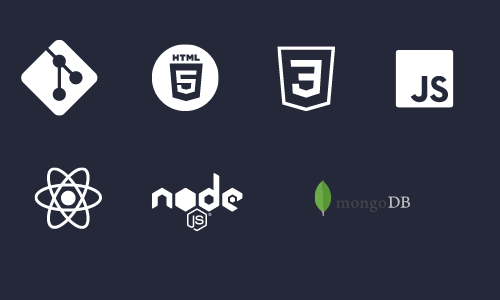

A self-motivaed and passionate aspiring web developer skilled in both front-end technologies like HTMl,CSS,Javascript,React,Material UI and back-end technologies like Node Js,Express,MongoDB DataBase.Undergone through Intensive and immersive 30 weeks of coding bootcamp at Masai School.I have worked on few projects collaboratively and solely. I always feel enthusiastic to learn new technologys to enhance my skills and bring value to the organization

<!--  -->

